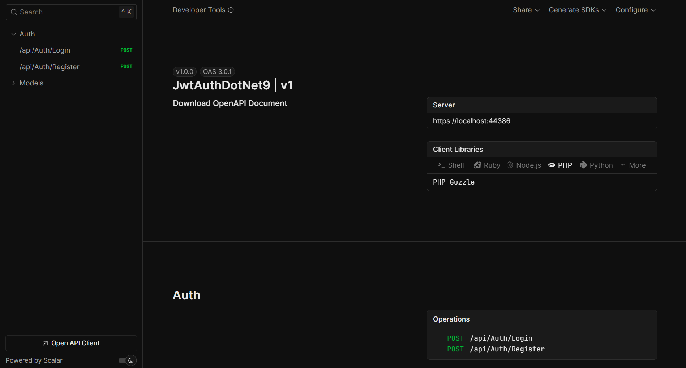

#Api denemesi için 
 https://localhost:44386/scalar/v1

  
 

Migration Komutları
Add-Migration migration_ismi -OutputDir Data/Migrations

## JWT Configuration

appsettings.json dosyanıza bu alanları doldurmanız gerekir

"AppSettings": {
  "Token": "super-secret-key",
  "Issuer": "MyCompany.AuthService",
  "Audience": "MyCompany.WebApi"
},
 "ConnectionStrings": {
     "UserDatabase": "your_connection_string",
    
 }

